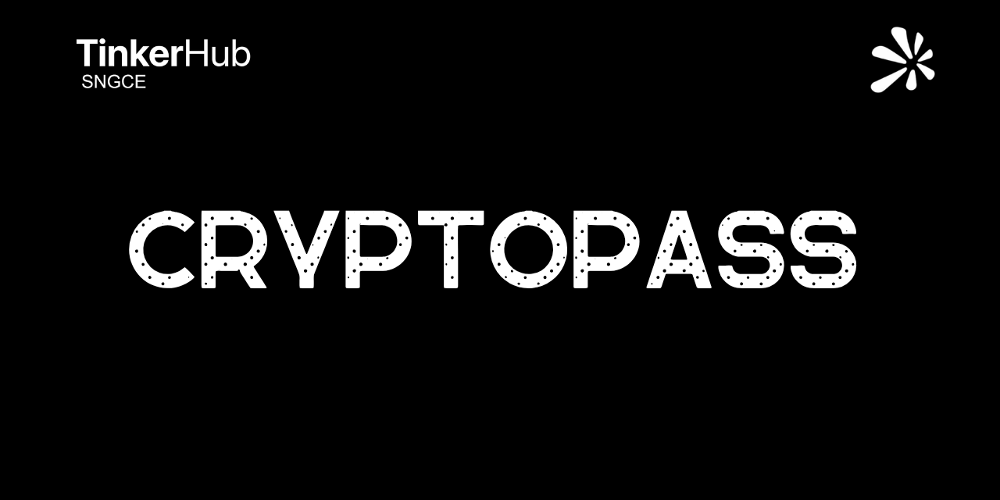

<!--banner.svg-->


# CryptoPass

A **cryptographic password engine** that generates unbreakable passwords using CSPRNG with AES-256 entropy. Zero-pattern detection, platform-aware character sets, and military-grade security.

<div align="center">

[](LICENSE)
[]
[]

</div>

---

## Features

| Feature | Description |
|:--------|:------------|
| **CSPRNG-Powered** | Uses `crypto.getRandomValues()` for mathematically secure randomness |
| **80-128+ Bit Entropy** | Military-grade entropy that resists brute-force attacks |
| **Platform Modes** | Optimized character sets for Instagram, WhatsApp, Gmail |
| **Passphrase Mode** | Human-readable word-chain passwords |
| **Zero Pattern Detection** | No repeated sequences, keyboard patterns, or dictionary words |
| **Entropy Visualization** | Real-time entropy strength meter |
| **No Storage** | Passwords never leave your browser |

---

## Usage

Open `index.html` in any modern browser — no server required.

```
    ┌─────────────────────────────────────┐
    │  Select Mode                       │
    │  ┌────────┐ ┌────────┐ ┌────────┐  │
    │  │Instagram│ │WhatsApp│ │ Gmail  │  │
    │  └────────┘ └────────┘ └────────┘  │
    │                                     │
    │  Configure                          │
    │  ├─ Length: [────●────] 16          │
    │  ├─ Uppercase [✓] Lowercase [✓]     │
    │  ├─ Numbers   [✓] Symbols   [✓]    │
    │                                     │
    │  Generate → Copy                    │
    └─────────────────────────────────────┘
```

---

## Security Details

### Entropy Calculation

```
Entropy = Length × log₂(Pool Size)
```

| Mode | Pool Size | Length | Entropy |
|:-----|:----------|:-------|:--------|
| Instagram | 68 | 12-18 | 74-111 bits |
| WhatsApp | 60 | 14-20 | 86-121 bits |
| Gmail | 70 | 18-24 | 112-148 bits |
| Custom | 26-95 | 8-64 | 37-400+ bits |

### Character Exclusions

Confusable characters are automatically excluded:
- **Uppercase:** `I`, `O`
- **Lowercase:** `l`, `o`
- **Numbers:** `0`, `1`

---

## Technical Stack

- **HTML5** — Semantic markup
- **CSS3** — Custom properties, grid, animations
- **Vanilla JavaScript** — No dependencies
- **Web Crypto API** — `crypto.getRandomValues()`

---

## License

MIT License — see [LICENSE](LICENSE)

---

<div align="center">

**Generated passwords are only as secure as your storage method.**

Use a reputable password manager. Never reuse passwords across platforms.

</div>